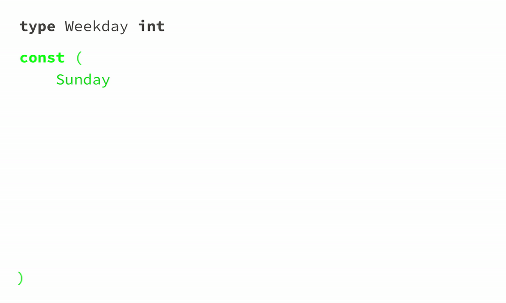

# Structs, Methods, and Enums in Go

## Structs

Structs are composite types that group together fields of different types.

### Defining and Using Structs

```go
type Person struct {
    Name string
    Age  int
}

// Create an instance of a struct
p := Person{Name: "John", Age: 25}
fmt.Println(p) // Output: {John 25}

// Access or modify fields
fmt.Println(p.Name) // Output: John
p.Age = 26
fmt.Println(p.Age) // Output: 26
```

### Anonymous Structs

You can define structs without giving them a name.

```go
emp := struct {
    ID   int
    Role string
}{ID: 101, Role: "Developer"}
fmt.Println(emp) // Output: {101 Developer}
```

---

## Methods

A method is a function with a receiver, enabling you to associate behavior with structs.

### Defining Methods

```go
type Circle struct {
    Radius float64
}

// Method with a value receiver
func (c Circle) Area() float64 {
    return 3.14 * c.Radius * c.Radius
}

// Method with a pointer receiver
func (c *Circle) SetRadius(r float64) {
    c.Radius = r
}
```

### Using Methods

```go
c := Circle{Radius: 5}

// Call a value receiver method
fmt.Println(c.Area()) // Output: 78.5

// Call a pointer receiver method
c.SetRadius(10)
fmt.Println(c.Area()) // Output: 314
```

### Pointer vs. Value Receivers

- **Value Receiver:** A copy of the struct is passed, and changes don't affect the original struct.
- **Pointer Receiver:** A pointer to the struct is passed, allowing modifications to the original struct.

---

## Enums (using iota)

Go doesn’t have a native `enum` type, but you can mimic enums using `const` and `iota`.

- `iota` is a special constant that starts at 0 and increments by 1 for each new constant.
- It’s common to use `iota` with `const` to define a set of related constants.

### Basic Enum-like Behavior

```go
type Status int

const (
    Pending Status = iota
    Approved
    Rejected
)

// Usage
status := Pending
fmt.Println(status) // Output: 0

if status == Pending {
    fmt.Println("Status is pending.")
}
```

### Custom String Representation for Enums

You can add a `String` method to your custom enum type.

```go
func (s Status) String() string {
    return [...]string{"Pending", "Approved", "Rejected"}[s]
}

// Usage
fmt.Println(Pending) // Output: Pending
fmt.Println(Approved) // Output: Approved
```

---

## Combining Structs, Methods, and Enums

Here’s an example bringing everything together:

```go
type Task struct {
    ID     int
    Title  string
    Status Status
}

func (t Task) Display() {
    fmt.Printf("Task #%d: %s - %s\n", t.ID, t.Title, t.Status)
}

func (t *Task) UpdateStatus(newStatus Status) {
    t.Status = newStatus
}

// Usage
func main() {
    task := Task{ID: 1, Title: "Write Go notes", Status: Pending}
    task.Display() // Output: Task #1: Write Go notes - Pending

    task.UpdateStatus(Approved)
    task.Display() // Output: Task #1: Write Go notes - Approved
}
```

---

## Key Points

- **Structs:** Use to group related data.
- **Methods:** Add behavior to structs. Use pointer receivers when you need to modify the struct.
- **Enums:** Mimic enums with `const` and `iota`. Add string representations for better readability.

---

## `iota` in action


