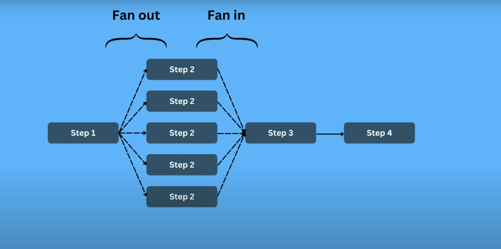
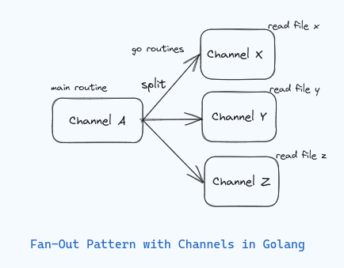

# **Fan-In and Fan-Out Patterns in Go**



Fan-In and Fan-Out are common concurrency patterns that involve managing data flow between multiple goroutines. Here's a breakdown:

---

### **Fan-Out Pattern**



Fan-Out is the process of distributing tasks to multiple worker goroutines for parallel processing. It helps utilize multiple CPU cores effectively.

#### **Example: Fan-Out**
```go
package main

import (
	"fmt"
	"sync"
	"time"
)

func worker(id int, jobs <-chan int, results chan<- int, wg *sync.WaitGroup) {
	defer wg.Done()
	for job := range jobs {
		fmt.Printf("Worker %d processing job %d\n", id, job)
		time.Sleep(time.Second) // Simulate work
		results <- job * 2      // Send result back
	}
}

func main() {
	const numWorkers = 3
	const numJobs = 10

	jobs := make(chan int, numJobs)
	results := make(chan int, numJobs)

	var wg sync.WaitGroup

	// Start worker goroutines
	for i := 1; i <= numWorkers; i++ {
		wg.Add(1)
		go worker(i, jobs, results, &wg)
	}

	// Send jobs to workers
	for j := 1; j <= numJobs; j++ {
		jobs <- j
	}
	close(jobs)

	// Wait for all workers to complete
	wg.Wait()
	close(results)

	// Collect results
	for result := range results {
		fmt.Println("Result:", result)
	}
}
```

---

### **Fan-In Pattern**


Fan-In is the process of combining results from multiple channels into a single channel. It consolidates concurrent outputs into one stream.

#### **Example: Fan-In**
```go
package main

import (
	"fmt"
	"time"
)

func generateNumbers(name string, ch chan<- int) {
	for i := 0; i < 5; i++ {
		fmt.Printf("%s sending: %d\n", name, i)
		ch <- i
		time.Sleep(500 * time.Millisecond) // Simulate processing time
	}
	close(ch)
}

func fanIn(ch1, ch2 <-chan int) <-chan int {
	out := make(chan int)
	go func() {
		for v := range ch1 {
			out <- v
		}
	}()
	go func() {
		for v := range ch2 {
			out <- v
		}
	}()
	return out
}

func main() {
	ch1 := make(chan int)
	ch2 := make(chan int)

	go generateNumbers("Source1", ch1)
	go generateNumbers("Source2", ch2)

	merged := fanIn(ch1, ch2)

	for v := range merged {
		fmt.Println("Received:", v)
	}
}
```

---

### **Fan-In and Fan-Out Combined**
A real-world application often uses both patterns together. For example:

1. A **Fan-Out** distributes work to multiple workers.
2. The workers' results are then merged using **Fan-In**.

#### **Example: Combining Fan-In and Fan-Out**
```go
package main

import (
	"fmt"
	"sync"
	"time"
)

func worker(id int, jobs <-chan int, results chan<- int) {
	for job := range jobs {
		fmt.Printf("Worker %d processing job %d\n", id, job)
		time.Sleep(time.Second) // Simulate work
		results <- job * 2      // Send processed result
	}
}

func fanIn(chs ...<-chan int) <-chan int {
	out := make(chan int)
	var wg sync.WaitGroup

	for _, ch := range chs {
		wg.Add(1)
		go func(c <-chan int) {
			defer wg.Done()
			for v := range c {
				out <- v
			}
		}(ch)
	}

	go func() {
		wg.Wait()
		close(out)
	}()

	return out
}

func main() {
	const numWorkers = 3
	const numJobs = 6

	jobs := make(chan int, numJobs)
	resultChans := make([]chan int, numWorkers)

	// Create worker result channels
	for i := 0; i < numWorkers; i++ {
		resultChans[i] = make(chan int, numJobs/numWorkers)
		go worker(i+1, jobs, resultChans[i])
	}

	// Distribute jobs
	go func() {
		for j := 1; j <= numJobs; j++ {
			jobs <- j
		}
		close(jobs)
	}()

	// Merge results from all workers
	mergedResults := fanIn(resultChans...)

	// Collect and print merged results
	for result := range mergedResults {
		fmt.Println("Final Result:", result)
	}
}
```

---

### **Key Notes**

!!! info "Fan-Out"
    - Ensures work is distributed among multiple goroutines for parallelism.
    - Use buffered channels to avoid blocking, if needed.

!!! info "Fan-In"
    - Combines multiple streams into a single stream.
    - Use `sync.WaitGroup` or closing channels to ensure all results are collected.

!!! example "Practical Use Cases"
    - Fan-Out: Web crawling, data processing.
    - Fan-In: Aggregating logs, consolidating API responses.
